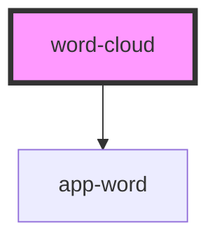

# word-cloud

<!-- Auto Generated Below -->

## Properties

| Property | Attribute | Description | Type       | Default     |
| -------- | --------- | ----------- | ---------- | ----------- |
| `words`  | --        |             | `string[]` | `undefined` |

## Dependencies

### Depends on

- [app-word](word)

### Graph

----------------------------------------------

*Built with [StencilJS](https://stenciljs.com/)*
